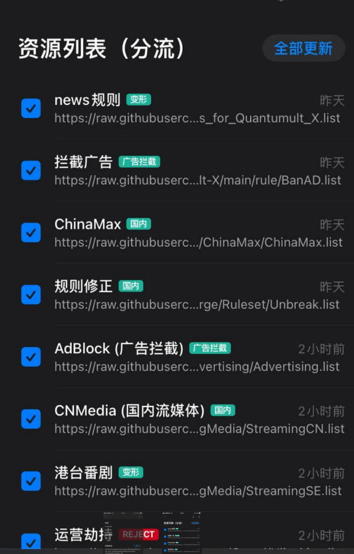
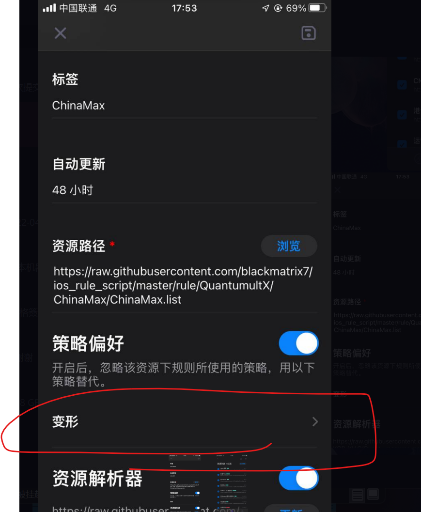
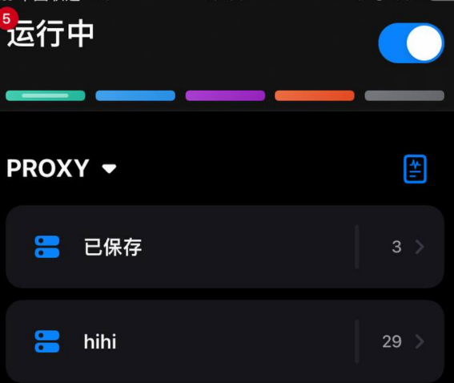

#### 节点

导入订阅总该会吧

利用解析器然后在订阅后面添加如下

```
#regex=(?=.*(\:80|\:443))^((?!(trojan=|shadowsocks=|vless=|★★★|✰✰✰|故障|神器|清理)).)*$&rename=@免流
```

比如你的订阅是

```
https://sub.store/download/hhh
```

添加后是

```
https://sub.store/download/hhh#regex=(?=.*(\:80|\:443))^((?!(trojan=|shadowsocks=|vless=|★★★|✰✰✰|故障|神器|清理)).)*$&rename=@免流&host=xxx
```

筛选出你的80,8080,443端口的节点，并且该节点不是trojan,shadowsocks,vless,并且更改了混淆为xxx，并且在节点名字后面添加免流二字

但是这个更改混淆的功能只能在你节点上已经有过混下的前提下才能进行添加的

如果你的节点是免流节点但是不带混淆，那么这个更改混淆的功能就失效

你有两种方法去解决这个问题

1，想你的机场组提出建议，添加host；或者是你自己的节点可以在windows的v2rayn 软件下添加

2，你可以去网站上转换下然后再添加
https://zhuan.mlsao.xyz/


随意选择一个混淆就可以

#### 策略

所有的策略都需要依赖分流才能正常运行

```
#以下为策略组[policy]部分
# static 策略组中，你需要手动选择想要的节点/策略组。
# available 策略组将按顺序选择你列表中第一个可用的节点。
# round-robin 策略组，将按列表的顺序轮流使用其中的节点。
# url-latency-benchmark 延迟策略组，选取延迟最优节点。
# dest-hash 策略组，随机负载均衡，但相同域名走固定节点。
# ssid 策略组，将根据你所设定的网络来自动切换节点/策略组
;img-url 参数用于指定策略组图标，可远程，也可本地/iCloud(Quantumult X/Images路径下) （108*108 大小）
;direct/proxy/reject 则只能用本地图标，名字分别为 direct.png, proxy.png,reject.png 放置于 Images 文件夹下即可生效 (108*108 大小)
```


##### 变形

这个策略是核心，是进行开启你是否进行免流的开关，你可以利用它来指向下一个策略(免流或者低延迟自动)

变形就类似一个菜单一样进行选择


##### 国内

由于我么有国内节点，所以我也只是把它作为免流节点进行使用。

如果你想把它作为你国内分流策略使用的话记住，那么就可能不能进行免流了因为他是低延迟进行切换策略（url-latency-benchmark），你如果想用它免流并且走国内的话，就要进行如下操作

###### 第一种

继续利用低延迟进行切换策略（url-latency-benchmark）策略

我用它筛选免流节点，

利用筛选(如果不会就去筛选那里的步骤看 [筛选](https://github.com/xmdgithub/quanxOfMl/tree/main#%E7%AD%9B%E9%80%89)) 使得该策略组内的所有节点都为国内免流节点，

我的筛选节点正则是

```
(?=.*(国内|免流|👾))^((?!(港|HK|(?i)Hong|台|TW|(?i)Taiwan|日|JP|(?i)Japan|美|US|(?i)States|American)).)*$
```

比如你想筛选出湖南的免流节点，就需要改写

```
(?=.*(湖南|国内|免流|👾))^((?!(港|HK|(?i)Hong|台|TW|(?i)Taiwan|日|JP|(?i)Japan|美|US|(?i)States|American)).)*$
```


###### 第二种

将策略类型变为static 策略组中，你需要手动选择想要的节点/策略组。自己手动去选择你需要使用的节点

然后打开分流设置

将所有与国内相关的设置为国内




将chinamax那个 



改写为国内，并且打开配置文件设置跳转到filter_local

将变形改为国内


##### 国外

这个策略唯一的作用就是当作一个中转站，可以用它来选择你想要选的国家，但是如果用了这个策略，那么就代表着和可能不会免流

##### myself

这个策略是你自己进行添加匹配的节点，由于策略的类型static，所以你可以直接去选取节点


##### 低延迟自动

这个策略不是进行免流的，你可以将所有节点或者你想要的节点放入进去，

##### ml低延迟自动

这个策略是进行免流的，你可以在这个策略中筛选出你的一些免流节点，**注意这个策略中只能放入免流节点，因为它是供上面变形以及其他策略选择的免流策略。如果这个策略中存在一些非免流节点的话就会导致有部分跳点


##### 各个国家

这个策略是利用正则表达式进行匹配的，可以看筛选策略中自己修改


##### 广告拦截

这个需要调整到reject才可以进行拦截广告


##### 漏网之鱼

这个是进行兜底的策略，意思是如果没有匹配到上面的策略，那么就走这个


策略整的不多，因为不可能一份策略适合所有人，最好用的配置往往是自己进行改写的，如果你感觉这份配置用着不舒服，可以自己去diy

如果你需要使用到这些策略的话你可以到配置文件中进行去掉这个注释然后进行修改


#### 重写

这个不进行讲解，他不会影响到免流的使用。

一般会影响免流的就只是策略以及分流(本地分流，远程分流)，以及把设置mpm关闭(不知道是不是玄学问题，在我个人看来这个开关会导致跳点)


#### 筛选

筛选的语法都是利用正则表达式

可以在这个学习一下

https://github.com/cdoco/common-regex

或者是这个简易的

```
(?=.*A)^(?=.*B)^.*$  节点名既有 A 又有 B
(A)|(B)                       节点名有 A 或者 B  
^((?!A).)*$                 节点名不含有A
(?=.*A)^((?!B).)*$   节点名含有 A，不含有 B
```


##### 策略组中进行筛选

###### 从订阅组中先进行第一步筛选

在策略组中筛选你可以长按策略然后点编辑


这个里面有上面匹配资源标签是匹配你的机场订阅的名字的例如下图这两个订阅组




直接最简单的方式是

如果你仅仅是想匹配到hihi 订阅组内的节点

那么你就要在这个里面填写 hihi

如果想同时匹配到 已保存和hihi 内的节点的话就需要填写  已保存||hihi

如果什么都不填写的话，那么就默认从全部的订阅组内进行匹配节点

###### 然后第二步筛选


```
(?=.*(🇻🇳|台|TW|(?i)Taiwan))^((?!(龙台|★★★|✰✰✰|故障|清理)).)*$
```

这个是匹配的你的节点的名称，

在第一步过滤后的节点组内进行出所有的包含🇻🇳|台|TW|(?i)Taiwan 并且不包含故障，清理...

这个只是举个例子，你可以自己进行添加和修改

```
(?=.*A)^(?=.*B)^.*$  节点名既有 A 又有 B
(A)|(B)                       节点名有 A 或者 B  
^((?!A).)*$                 节点名不含有A
(?=.*A)^((?!B).)*$   节点名含有 A，不含有 B
```

